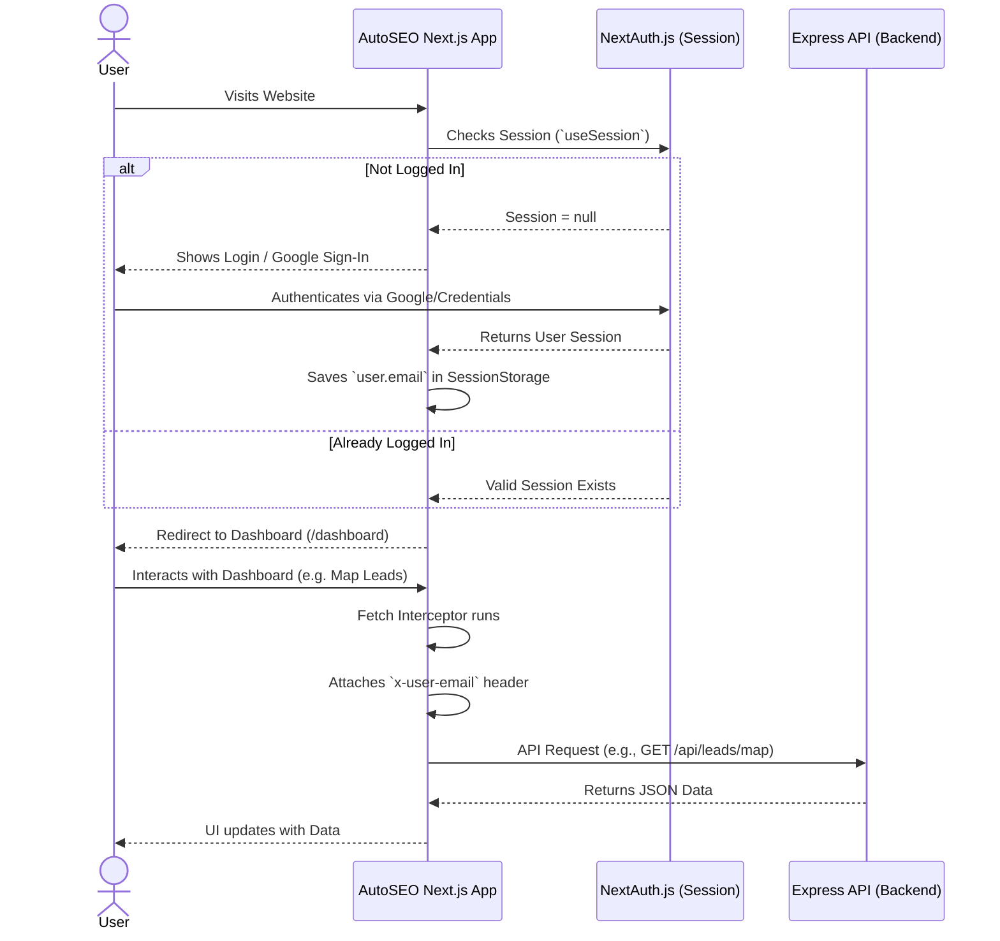
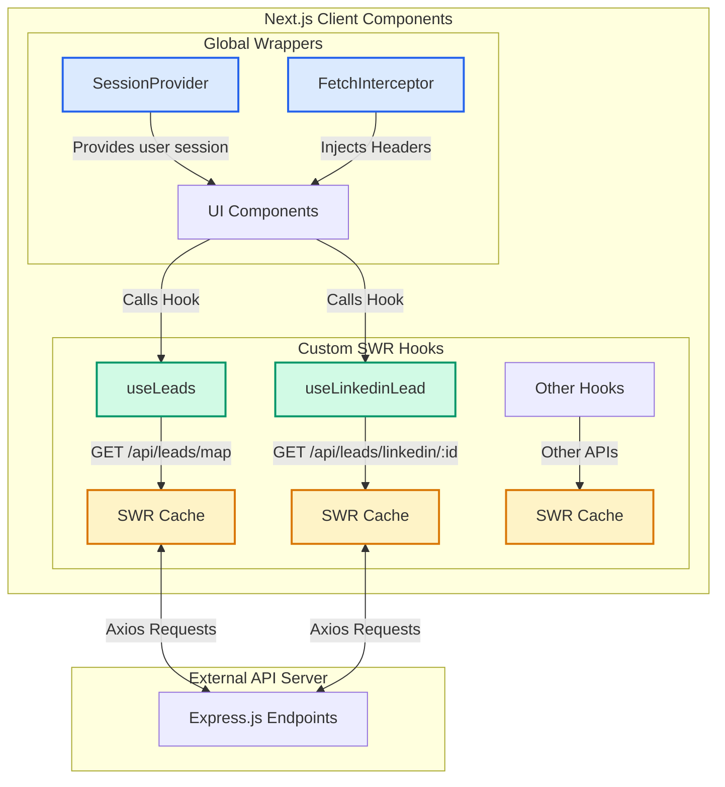

# Auto SEO Pro - Architecture & Flow

Sorry for the confusion! Yeh document **Auto SEO Pro** project ke overall architecture, user journey, aur state management (Data Flow) ko explain karta hai.

---

## 1. User Journey & Authentication Flow (User Aayega Toh Kya Hoga)

**Auto SEO Pro** mein `NextAuth.js` ka use hua hai authentication ke liye.



---

## 2. State Management & Data Fetching

Is project mein **Redux ya Zustand ka use nahi hai**. Data fetching aur state management ke liye **SWR (Stale-While-Revalidate)** use kiya gaya hai. SWR APIs se data lata hai aur use locally cache kar leta hai.



### Key Highlights of Architecture:
1. **Next.js App Router:** Project latest App Router (`src/app`) use karta hai. UI server aur client components mein divided hai.
2. **SWR for State:** Redux ki jagah SWR ka cache as a global state kaam karta hai. Agar ek component data fetch karta hai, toh doosra component bina dobara API call kiye cache se data le sakta hai.
3. **Fetch Interceptor:** `Providers.tsx` mein ek custom fetch interceptor hai. Yeh har API call ko pakadta hai, SessionStorage se `user.email` nikalta hai, aur request ke headers mein `x-user-email` laga kar backend ko bhejta hai (For auth verification on backend).

---

## 3. Feature Flow Example: Generating Leads

Agar user "Generate Leads" par click karta hai toh under-the-hood kya hota hai:

```mermaid
flowchart LR
    A[User clicks 'Generate'] --> B[useMapLeads Hook]
    B -->|axios.post| C[Backend API /api/leads/map/generate]
    C -->|Starts Background Job| D[Queue/Worker]
    C -->|Returns Success| B
    B -->|mutate()| E[SWR re-fetches Data]
    E -->|Updates UI| F[User sees New Lead]
```

- Jab `mutate()` call hota hai, SWR background mein list ko dobara fetch karta hai aur UI ko instantly update karta hai bina page refresh kiye.
