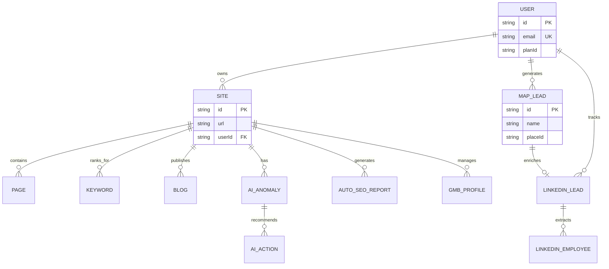
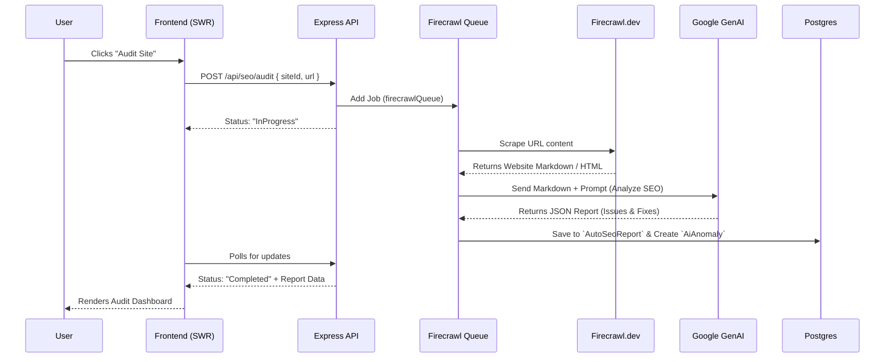
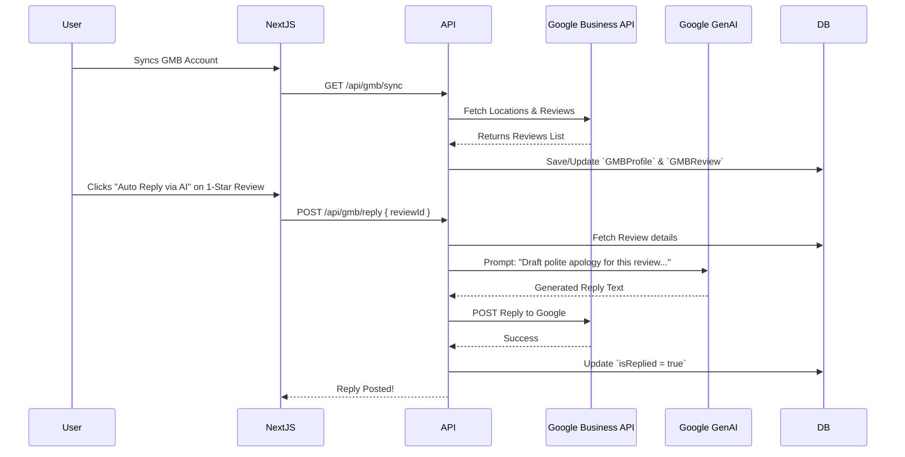
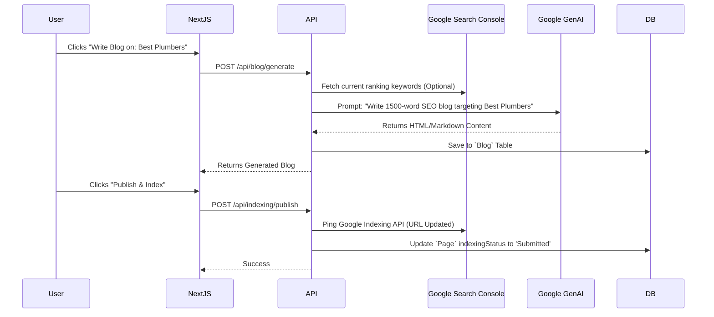
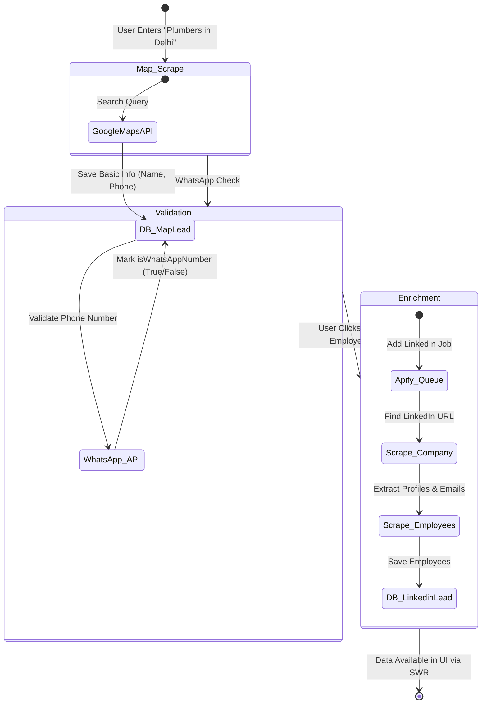
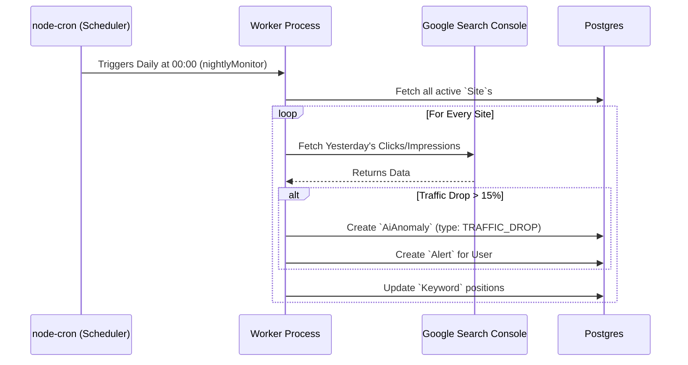

# Auto SEO Pro - Official Technical Documentation

<br>

> [!IMPORTANT]  
> This is the complete, professional, and detailed technical documentation for **Auto SEO Pro**. It covers the entire architecture, technology stack, database schema, and core business workflows of the platform.

---

## 1. Executive Summary
**Auto SEO Pro** is an automated, AI-driven SEO platform designed to simplify website optimization, lead generation, and technical SEO analysis. The platform operates on a "plug-and-play" model where users provide a URL, and the system automatically audits the site, fixes issues, writes SEO-optimized content, and generates local leads (Google Maps & LinkedIn) using background workers.

---

## 2. Technology Stack

### Frontend (Client App)
- **Framework:** Next.js 15 (App Router)
- **Authentication:** NextAuth.js
- **State Management & Fetching:** SWR (Stale-While-Revalidate) & Axios

### Backend (API & Workers)
- **Framework:** Node.js with Express.js (TypeScript)
- **Database:** PostgreSQL (managed via Prisma ORM)
- **Job Queues:** Redis + BullMQ
- **Scraping/Crawling:** Apify, Puppeteer, Firecrawl API
- **AI Integrations:** Google Generative AI (`@google/genai`)

---

## 3. Database Entity-Relationship (ER) Diagram



---

## 4. Comprehensive Feature Flows (Step-by-Step Diagrams)

Below are the exact execution sequences for **EVERY major feature** inside Auto SEO Pro.

### Flow 1: Firecrawl & AI Site Auditing (Technical SEO)
When a user adds a new site or requests an audit, Firecrawl scrapes the site, and Google AI generates a report.



### Flow 2: Google Business Profile & Review Auto-Reply
Managing local reputation via Google APIs.



### Flow 3: AI Content & Blog Generation
Writing SEO-optimized content automatically and publishing it.



### Flow 4: Map Leads & LinkedIn Enrichment (B2B Lead Gen)
The most complex background job flow in the system. Scraping Google Maps, finding the company on LinkedIn, and extracting employee emails.



### Flow 5: Nightly Monitoring (CRON Jobs)
How the system tracks rank drops automatically while the user is asleep.



---

## 5. System Architecture & Queue Processing

Because scraping LinkedIn or running a Lighthouse audit takes time, the system relies on an asynchronous queue pattern:

```mermaid
graph TD
    subgraph Express API Server
        Endpoint[Route Handlers]
        BullMQ_Publisher[BullMQ Add Job]
    end

    subgraph Redis Cache
        Queue[(Job Queue)]
    end

    subgraph Background Workers (Processor)
        W_LinkedIn[LinkedIn Apify Worker]
        W_Map[Google Maps Worker]
        W_WA[WhatsApp Validation Worker]
        W_Fire[Firecrawl Audit Worker]
    end

    Endpoint --> |Push| BullMQ_Publisher
    BullMQ_Publisher --> |Enqueue| Queue
    Queue --> |Consume| W_LinkedIn & W_Map & W_WA & W_Fire
```

---

## 6. Next Steps & Scaling
- Because workers are decoupled via Redis, you can scale the `backend` horizontally by adding more Node.js instances just to process jobs faster.
- SWR on the frontend ensures that even with hundreds of leads loading, the UI remains snappy and caches aggressively without refreshing the page.
