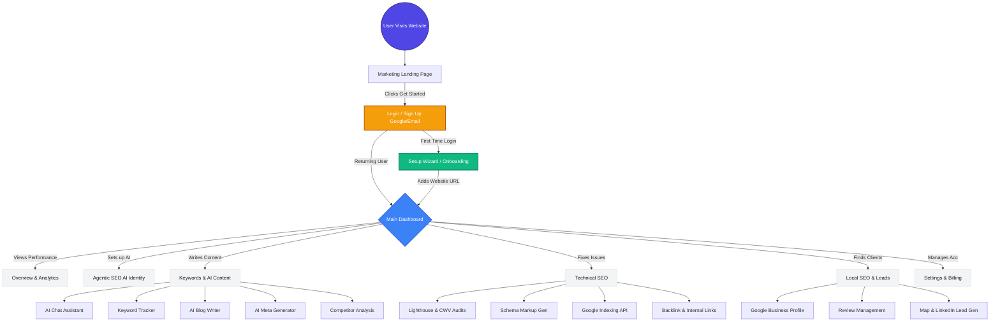

# Auto SEO Pro - Complete UI Flow & User Capabilities

Yeh document explain karta hai ki **ek naya user jab Auto SEO Pro par aata hai, toh uski journey kaisi hoti hai** aur woh kya-kya kar sakta hai.

---

## 1. Complete User Journey Flowchart

Neeche diya gaya diagram ek naye user ka A to Z flow darshata hai: Landing Page se lekar Onboarding aur Dashboard Dashboard features tak.

---

## 2. Naya User Kya-Kya Kar Sakta Hai? (Feature Breakdown)

Jab ek user login kar leta hai, toh uske paas yeh **5 badi capabilities** hoti hain:

### 🚀 1. Agentic SEO (Autopilot SEO)
- **AI Identity Setup:** User apne business ke baare mein AI ko batata hai. AI automatically samajh jata hai ki website ka tone, audience, aur goal kya hai, aur phir khud se recommendations deta hai.

### ✍️ 2. Keywords & AI Content (Content Creation)
- **Keyword Tracker:** Apni website ke keywords Google mein kis rank par hain, woh track kar sakta hai.
- **AI Blog Writer:** Sirf topic daal kar, SEO-optimized, lambe-lambe articles seconds mein likhva sakta hai.
- **AI Meta Generator:** Page ke titles aur meta descriptions automatically generate kar sakta hai jisse Google click-through rate (CTR) badhe.
- **Competitor Analysis:** Apne competitors ki website track karke dekh sakta hai ki woh kin keywords par rank kar rahe hain.

### 🛠️ 3. Technical SEO (Website Fixes)
- **Lighthouse & Core Web Vitals:** Website ki speed, mobile-friendliness, aur performance check kar sakta hai. AI usko fix karne ka exact code/tarika batata hai.
- **Schema Markup:** Bina coding aane, JSON-LD schema (FAQ, Product, Local Business) bana sakta hai.
- **Indexing API:** Naye pages ya blogs banne par Google ko turant (instant) ping karke index karwa sakta hai bina search console ka wait kiye.
- **Backlinks & Internal Links:** Dekh sakta hai ki kaun uski website ko link kar raha hai.

### 📍 4. Local SEO & Leads (Business Growth)
- **Google Business Profile:** Apni GMB profile ko ek hi jagah se manage kar sakta hai.
- **Review Management:** Customers ke reviews ka AI dwara automatically reply kar sakta hai.
- **Map & LinkedIn Leads:** Kisi bhi area ke local businesses (jaise "Plumbers in Delhi") ka data extract kar sakta hai (Phone, Email, Website) aur LinkedIn se employee data nikal kar client bana sakta hai.

### ⚙️ 5. Setup & Billing
- **Site Selector:** Ek se zyada websites manage kar sakta hai (Agency mode).
- **Billing:** Apni subscription upgrade kar sakta hai (Free to Pro/Agency).
